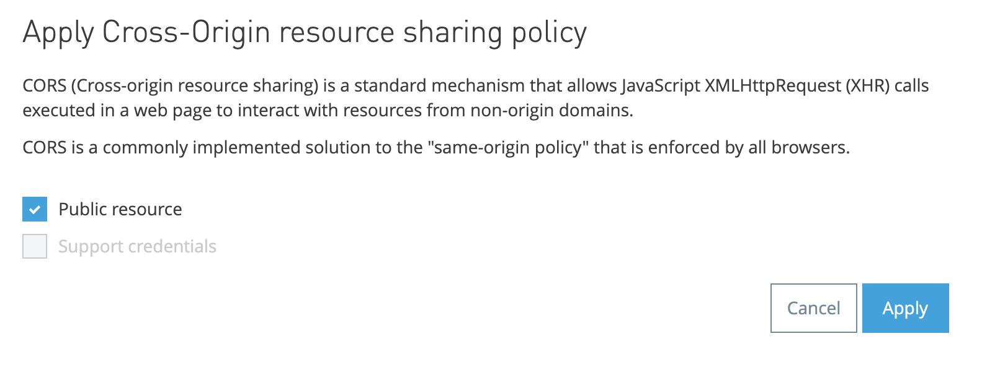
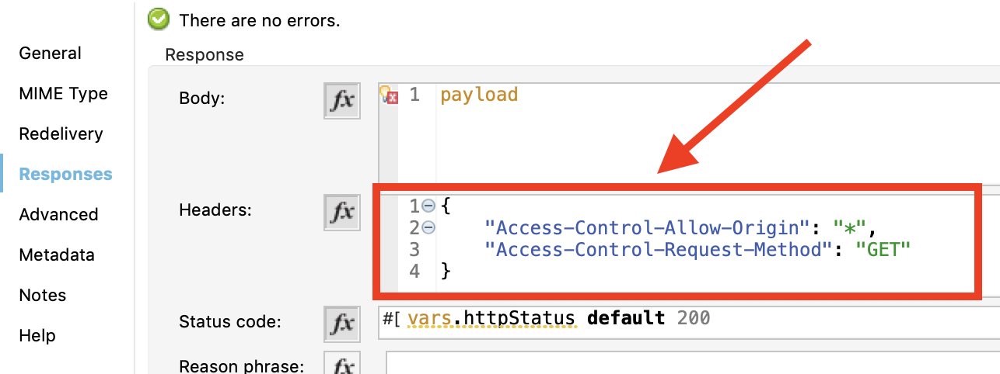
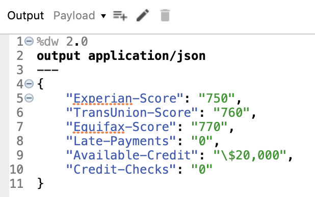
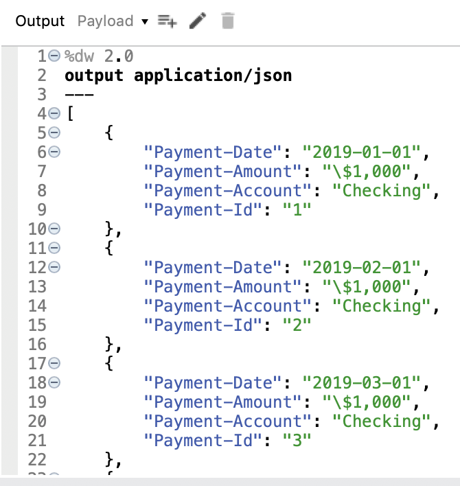

# Mule-LWC-Server-Sample
Link to related LWC package: https://github.com/mkoscak-mulesoft/Mule-LWC-Samples<br/><br/>
This code is a sample Mule project for an experience API that can be called by Salesforce Lightning Web Component.  This app is a basic API meant to demonstrate formatting.  When creating your own custom demo, decide the data you will be outputting, and create flows that output the data in the same format listed below.  Then configure the LWC package to call those flows.<br/><br/>
Note that when implementing your own API for your use case you can create directly within studio and skip RAML scaffolding if desired.<br/><br/>

## CORS Config
Salesforce will validate CORS and so you must setup your Mule app to handle this appropriately.  It can be done one of 2 ways.<br/><br/>
**Option 1**: Use API manager and add the Cross-Origin Resource Sharing Policy set to Public Resource. 
<br/><br/>
**Option 2**: Manually return the appropriate headers in your Mule app.  Add the below headers to your HTTP response<br/>
```json
{
	"Access-Control-Allow-Origin": "*",
	"Access-Control-Request-Method": "GET"
}
```

<br/><br/><br/>
## Data Format Structure
The format you pass the data is critical to the LWC correctly rendering.  Use the format below in a given flow passing back to the relevant LWC.  **Note that if using a transform component you need to output json and not a java object**.<br/>Each component's format is as follows:<br/><br/>
**Related Info View Component:**<br/>
This needs to return a 1 level deep json object.  <br/>Use format below:<br/>
```json
{
	"Key-1": "Value 1",
	"Key-2": "Value 2"
}
```
The demo I use outputs the following:

<br/><br/>
______________________________________________<br/>
**Related Table View Component:**<br/>
This needs to return an array of 1 level deep json objects.  **You need to have all the keys/columns be consistent in order to output the table correctly**.<br/>  Use format below:<br/>
```json
[
	{
		"Key-1": "Value 1",
		"Key-2": "Value 2"
	},
	{
		"Key-1": "Value 3",
		"Key-2": "Value 4"
	},
	{
		"Key-1": "Value 5",
		"Key-2": "Value 6"
	}
]
```
The demo I use outputs the following:
